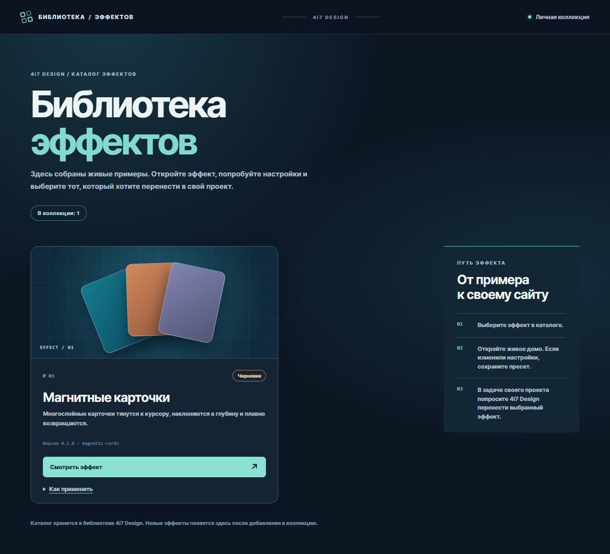

# 4i7 Design — библиотека эффектов для сайтов

**4i7 Design** — каталог интерактивных эффектов и одноимённый скилл Codex. На странице каталога можно просмотреть карточки эффектов, открыть живое демо, подобрать настройки и сохранить пресет. Затем скилл помогает перенести выбранный эффект в конкретный сайт.

Сейчас в каталоге один эффект: **Magnetic Cards** (`magnetic-cards`, версия `0.1.0`, статус `draft`). Статус означает, что эффект доступен для просмотра и пробы, но ещё не принят как окончательная версия.



## Установка и просмотр

Для локального запуска нужны Node.js и npm; в GitHub Actions проект проверяется на Node.js 24. Чтобы Codex находил скилл по имени `$4i7-design`, клонируйте репозиторий в каталог личных скиллов. Пример для PowerShell:

```powershell
git clone https://github.com/i4w7w4a/4design-7effects-2library.git "$env:USERPROFILE\.agents\skills\4i7-design"
Set-Location "$env:USERPROFILE\.agents\skills\4i7-design"
npm ci
npm run catalog:check
npm run library:start
```

Команда напечатает фактический локальный адрес. Откройте его без параметров: на `/` находится галерея всех эффектов. Нажмите «Смотреть эффект» на карточке, чтобы открыть демо. В разделе карточки «Как применить» можно скопировать запрос для задачи целевого проекта. Для Magnetic Cards прямой маршрут — `/?effect=magnetic-cards`.

```powershell
npm run library:status  # показать адрес и состояние
npm run library:start   # открыть снова; повторно использует работающий сервер
npm run library:stop    # остановить
```

Сервер слушает только `127.0.0.1` и автоматически останавливается после 60 минут без HTTP-запросов. Адрес доступен лишь пока сервер работает. Для разработки с живой перезагрузкой есть `npm run dev`.

## Использование через Codex

В задаче Codex можно сказать:

- «`$4i7-design` открой библиотеку» — запустить каталог и показать его в браузере;
- «`$4i7-design` найди эффект, при котором карточки тянутся к курсору» — искать по названию или описанию;
- «`$4i7-design` покажи Magnetic Cards и открой демо» — посмотреть конкретный эффект;
- «`$4i7-design` примени сохранённый вариант Magnetic Cards к карточкам этого сайта» — такую задачу нужно начать **из целевого проекта**.

В демо можно менять параметры. Кнопка сохранения создаёт JSON-файл `.local/sessions/<id>.json` с ID эффекта, версией и полным набором настроек. Эти файлы остаются на данном компьютере и не попадают в Git. Если хотите перенести именно настроенный вариант, сначала сохраните его в демо. При переносе скилл проверяет целевой сайт, адаптирует код и стили и записывает `design-effects.lock.json` с ID, версией, коммитом библиотеки и параметрами. Обновление библиотеки не меняет уже перенесённый эффект автоматически.

## Где что хранится

| Путь | Назначение |
| --- | --- |
| `SKILL.md`, `agents/openai.yaml` | Правила скилла и его отображение в Codex |
| `catalog/index.jsonl` | Компактный индекс для поиска и карточек галереи |
| `effects/<id>/effect.json` | Название, описание, версия, статус и маршрут демо |
| `effects/<id>/README.md`, `controls.schema.json`, `src/` | Описание, допустимые настройки и переносимая реализация эффекта |
| `playground/` | Локальная галерея, демо и панель настройки |
| `.local/sessions/` | Личные сохранённые пресеты; папка исключена из Git |

Галерея отображает записи из индекса; исходники и метаданные эффектов хранятся в Git-репозитории. Для поиска из терминала используйте `npm run catalog:search -- --query "карточки тянутся к курсору"`.

## Добавление эффекта

1. Создайте `effects/<id>/` с `effect.json`, описанием, схемой параметров, независимым кодом и проверками. ID должен совпадать с именем папки.
2. Добавьте маршрут `/?effect=<id>` и живое демо в `playground/`; проверьте переход из карточки каталога и обратно.
3. Выполните `npm run catalog:build`, затем `npm run catalog:check`. Индекс строится из `effects/*/effect.json`; вручную редактировать его не нужно.
4. Оставьте статус `draft`, пока не проверены внешний вид, взаимодействие, доступность и перенос в целевой сайт. После принятия можно сменить статус на `ready` и выпустить новую версию.

Стабильный идентификатор эффекта — его `id`; номер карточки может измениться при росте каталога.

## Проверки

```powershell
npm run catalog:check
npm test
npm run test:launcher
npm run build
```

Для браузерных проверок на Windows используется установленный Microsoft Edge; на других системах сначала выполните `npx playwright install chromium`. Затем запустите `npm run test:e2e`. GitHub Actions запускает проверку индекса, тесты, проверку запуска и сборку при отправке изменений и в pull request.

## Размещение на сервере

`npm run build` создаёт статическую версию каталога в `dist/`. Галерея и демо могут работать как статический сайт. Сохранение пресетов сейчас обращается к `POST /api/presets`, который реализован только в локальном Vite-сервере и пишет файлы в `.local/sessions/`. Перед внешним размещением этой функции понадобится отдельный серверный обработчик и хранилище либо другой способ экспорта настроек.

## Права

Репозиторий имеет статус `UNLICENSED`. Публичная доступность исходников сама по себе не даёт третьим лицам права копировать, изменять или распространять код. Для использования вне проектов владельца нужна отдельная лицензия или разрешение. Происхождение и ограничения отдельных эффектов описываются в их карточках.
